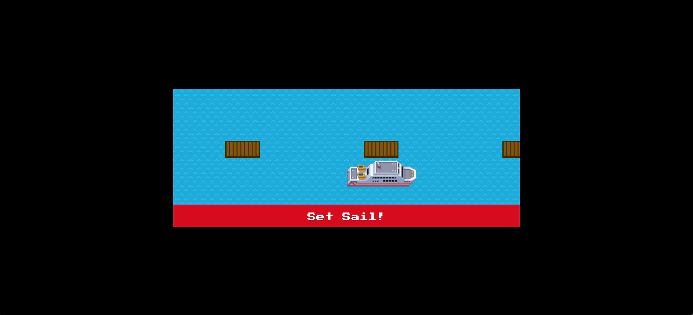
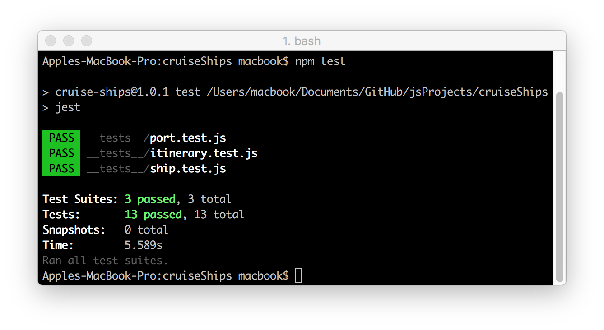

# Cruise Ships :ship:
There's a lot more to a smooth cruise ship operation than just sailing a ship. Ships dock at different ports based on a travel itinerary. These ports can only take so many ships at a time. Did we mention that these cruise ships are operated by the _British_!? They'll refuse to sail in even the tamest weather conditions.

Building your own **cruise ships** application, building and working with many objects that allow a cruise ship to operate. Hopefully we don't hit any icebergs on the way.

Building a GUI (Graphical User Interface) for the Cruise Ships Challenge.

### Built With
* [npm](https://www.npmjs.com/) - Node Package Manager
* [Jest](https://facebook.github.io/jest/) - JavaScript Testing Framework

